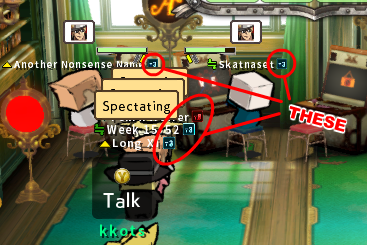

# GGXrdAdjustConnectionTiers


Changes connection tiers (T4, T3, T2, T1 and T0) in Guilty Gear Xrd -REVELATOR- Rev2 version 2211 (works as of 6'th December 2024).  
This affects the listing of 'Friend'/'Player'/'Private' (same thing called different names) lobbies (see screenshot below),


, the filtering of 'Friend' lobbies based on pings (same screenshot), and the connection tier icon next to a player's name when inside a 'Friend' lobby (see screenshot below).



What this mod does **NOT** affect: other people joining your room with a bad connection.

It is unknown whether the mod affects World Lobbies or Ranked Match - not tested.

The default ping thresholds that the game uses are:

- 0 to 60ms - **T4**;
- 61 to 100ms - **T3**;
- 101 to 200ms - **T2**;
- 201 to 300ms - **T1**;
- \>300ms - **T0**.

## How this mod affects room/player filtering based on connection level

This mod affects how the lobbies are filtered on your end based on 'Search Room - Room Connection Restrictions' you select when you **search** for a room.

When you **create** a room and set its 'Room Connection Restrictions', the people who use this mod may still be able to join with a bad connection, because the decision whether they can join is made on *their* client's end using the ping, the modded connection tier values that *they* have, and the connection restriction that you set for you room. In other words:

`CAN_JOIN = ( CALCULATE_CONNECTION_TIER(PING) >= ROOMS_CONNECTION_RESTRICTION )`

^ this happens on the **joining** player's client side.

Same happens when you try to join other people's rooms. You may join connection level-restricted rooms while having a bad ping, by changing your connection tiers using this mod, so that the `tier` that you calculate on *your* side is `>=` the `required connection tier` of a room.

## Usage on Windows

Launch GGXrdAdjustConnectionTiers.exe or GGXrdAdjustConnectionTiers_32bit.exe, edit the ping values and press the **Patch GuiltyGear** button.  
Close the mod.  
Launch Guilty Gear Xrd.  
You don't need to ever launch this mod again unless you want to change the ping thresholds.

## Usage on Linux

The launcher provided (launch_GGXrdAdjustConnectionTiers_linux.sh) only works if your Steam on Linux launches Guilty Gear Xrd through Steam Proton.  
Cd into the directory where `GGXrdAdjustConnectionTiers_32bit.exe` and `launch_GGXrdAdjustConnectionTiers_linux.sh` files are and give yourself permission to execute the .sh script:

```bash
cd GGXrdAdjustConnectionTiers
chmod u+x launch_GGXrdAdjustConnectionTiers_linux.sh
# Launch Guilty Gear first, then script
./launch_GGXrdAdjustConnectionTiers_linux.sh
```

The .sh script will launch the app's 32-bit .exe through Wine in the same virtual environment as Guilty Gear Xrd. You may then close Guilty Gear Xrd and press the **Patch GuiltyGear** button.

Running the 64-bit version of the mod will cause this error:

```bash
Application could not be started, or no application associated with the specified file.
ShellExecuteEx failed: File not found.
```

It is caused by attempting to run a 64-bit program on a 32-bit Wine prefix. Guilty Gear Xrd is a 32-bit game and is in a 32-bit Wine prefix.

After patching, Steam may start downloading 4GB of stuff and say it's validating something in this game. It will in fact not alter the patched files after it is over, and all the changes will remain.

## Undoing changes if game stopped working

If after pressing the **Patch GuiltyGear** button the game stopped working, you can go into the game installation directory and find and replace the following files:

- Replace `...\Binaries\Win32\GuiltyGearXrd.exe` with `...\Binaries\Win32\GuiltyGearXrd_backup.exe`

This should undo all the changes done by the mod.

## Compilation

To compile, open the .sln file in Visual Studio (I use Visual Studio Community Edition 2022) and press Build - Build Solution. It will say where it compiled the .exe file in the Output panel.

## About

**Guilty Gear** is a registered trademark of ARC SYSTEM WORKS CO., LTD. Me and this code are in no way affiliated with them or being endorsed by them.
